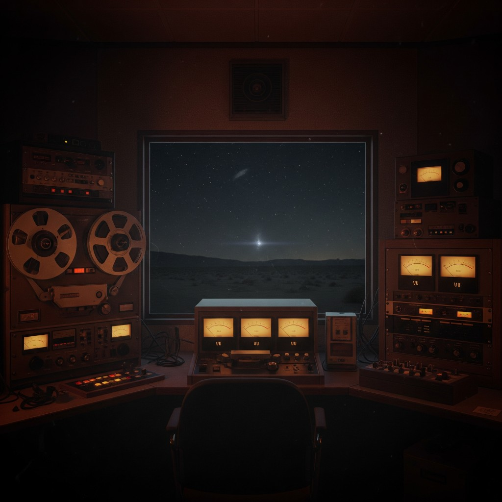

# 01 — Into the Bore (The Frantic Caller)

**Epoca:** 1997 (11 settembre)  
**Atto:** Prologo  
**Ruolo narrativo:** Apertura. Campiona evento radiofonico reale.

## Artwork



---

## Concetto

L'album si apre con domande su distanza, prova e musica — poi (o sotto) il campionamento del **Frantic Caller**: la chiamata reale ad Art Bell, 11 settembre 1997. Il segnale cade a metà frase. Il bore si apre.

---

## Struttura suggerita

```
[Testo originale — domande]
[Campionamento Frantic Caller — audio reale]
[Sick, sick, we are sick… — coda]
```

---

## Testo

Does the water fall on distant planets?  
Where's the final proof we're looking for?  
Does the sound of a rock and roll band reach the furthest galaxy?  
Where's the proof we're looking for?

Loneliness feeds curiosity — unless loneliness feeds curiosity.

*(campione: The Frantic Caller — Art Bell, 11 set 1997)*

Sick, sick, we are sick,  
We are sick…

---

## Traduzione italiana

L'acqua cade su pianeti lontani?  
Dov'è la prova definitiva che cerchiamo?  
Il suono di una rock band raggiunge la galassia più lontana?  
Dov'è la prova che cerchiamo?

La solitudine alimenta la curiosità — a meno che la solitudine non alimenti la curiosità.

*(campione: The Frantic Caller — Art Bell, 11 set 1997)*

Malati, malati, siamo malati,  
siamo malati…

---

## Analisi

### Cosa funziona

| Elemento | Perché |
|---|---|
| **Where's the proof we're looking for?** | Bookend diretto con **Distance Proof** (09). L'album apre e chiude sulla stessa domanda |
| **sound of a rock and roll band** | Tema centrale: la musica che viaggia oltre ogni distanza |
| **Loneliness feeds curiosity** | Radio notturna, ascolto solitario — Art Bell, il Frantic Caller, poi Room |
| **Sick, sick, we are sick** | Coda viscerale: malattia del mondo, voce del caller, eco verso Jaded |
| **Domande senza risposta** | Prologo giusto — l'album risponderà (troppo tardi) in Distance Proof |

### Punti da tenere d'occhio

**1. Planets / galaxy vs bore/tempo**  
Come Room nella bozza originale, c'è lessico **spaziale**. Funziona come mistero di apertura, ma in produzione il campionamento Frantic Caller ancorerà il pezzo alla **radio reale**. Le domande cosmic → il segnale terrestre interrotto.

**2. Ripetizione**  
*Where's the [final] proof we're looking for?* ×2 — intenzionale (insistenza). Valutare se la seconda variante (*final* proof) resta o si unifica.

**3. Grammatica (corretta in testo sopra)**  
- *water falls* → *water fall*  
- *distance* → *distant*  
- *farest* → *furthest*  
- *Again loneliness feed* → *Loneliness feeds*

**4. Paradosso loneliness**  
*Bellezza concettuale* — la curiosità nasce dalla solitudine, ma anche la consuma. Coerente con ascoltatore notturno e mondo jaded.

### Confine con le altre tracce

| Traccia | Confine |
|---|---|
| **Room** | Room = *we copy* attivo. Into the Bore = domande + sample reale. Nessuna sovrapposizione |
| **No Sense** | No Sense = dialogo I/you. Qui = domande cosmiche + sample. Ok |
| **Distance Proof** | *Proof* qui è domanda; lì è rivelazione tragica. Arco forte |

---

## Riferimenti audio

- [Art Bell Archive — 11 set 1997](https://artbellarchive.org/episode/september-11-1997-open-lines-with-area-51-employees-call-in)
- [YouTube — Area 51: the frantic caller](https://www.youtube.com/watch?v=upADHNA4AIQ)

---

## Collegamenti

- **→** 03 Room (stesso medium: radio, ascolto)
- **→** 09 Distance Proof (*proof* — bookend)

---

<details>
<summary>Bozza originale RTF (archivio)</summary>

Does the water falls in distance planets?  
Where's the final proof we're looking for?  
Does a sound of a rock and roll band reach the farest galaxy?  
Where's the proof we're looking for?  
Again loneliness feed curiosity, unless loneliness feeds curiosity.

Sick, sick, we are sick,  
We are sick...

</details>
