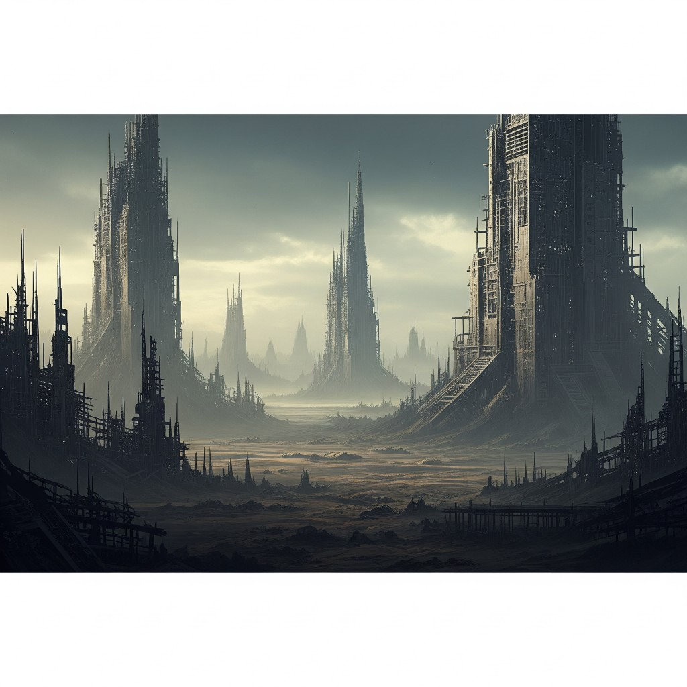

# 02 — Jaded

**Epoca:** 5125  
**Atto:** I — Il mondo che cade  
**Ruolo narrativo:** Collasso del mondo futuro.

## Artwork

---

## Concetto

Il pianeta alla fine. Non un'esplosione, ma un esaurimento — e una voce che non ha più forza tranne quella di incolpare, ricordare, crollare. *Jaded* come stanchezza che ha attraversato il dolore e ne esce amara.

**Nota strutturale:** questa traccia è la **fonte** di Dadej (07) — stesso materiale in reverse.

---

## Testo

### Intro

You left my heart in chains  
and if I bleed who cares?  
I need someone to blame  
now I just dry my tears  
tell me why you did it  
don't want your lies *(lies lies lies…)*

### Ritornello

All pieces of my broken youth  
I will put them all in a damn trailer  
Black and white scenes of a childhood  
Painted on with scars, red and blood

No more chance to break this deadly chain  
You'll be there to see me when I fall

### Bridge

You see  
the world is crashing down  
And if it bleeds who cares?  
don't stop the words in your head…

### Ritornello

All pieces of my broken youth  
I'll put them all in a damn trailer  
No more chance to break this chain  
You'll be there to see me when I fall

### Outro *(ad libitum → crescendo)*

I lose control  
I lost my self  
I lose control  
I lost my self  
I lose control  
I lose control *(crescendo)*

---

## Traduzione italiana

### Intro

Hai lasciato il mio cuore incatenato  
e se sanguino, a chi importa?  
Ho bisogno di qualcuno da incolpare  
ora asciugo solo le lacrime  
dimmi perché l'hai fatto  
non voglio le tue bugie *(bugie bugie bugie…)*

### Ritornello

Tutti i pezzi della mia giovinezza spezzata  
li metterò in un maledetto rimorchio  
Scene in bianco e nero di un'infanzia  
Dipinte con cicatrici, rosso e sangue

Non c'è più possibilità di spezzare questa catena mortale  
Ci sarai tu a vedermi quando cadrò

### Bridge

Vedi  
il mondo che crolla  
E se sanguina, a chi importa?  
non fermare le parole nella tua testa…

### Ritornello

Tutti i pezzi della mia giovinezza spezzata  
li metterò in un maledetto rimorchio  
Non c'è più possibilità di spezzare questa catena  
Ci sarai tu a vedermi quando cadrò

### Outro *(ad libitum → crescendo)*

Perdo il controllo  
Ho perso me stesso  
Perdo il controllo  
Ho perso me stesso  
Perdo il controllo  
Perdo il controllo *(crescendo)*

---

## Analisi

### Cosa funziona

| Elemento | Perché |
|---|---|
| **the world is crashing down** | Unico punto esplicito di collasso planetario — ponte verso la trama 5125 |
| **if I bleed / if it bleeds who cares?** | Apatia jaded — eco verso *nothing left to desire* (Distance Proof) |
| **broken youth / childhood / scars** | Memoria personale in un mondo senza futuro — il passato come carico |
| **damn trailer** + pezzi di youth | Immagine forte: infanzia confinata in un contenitore — foreshadow **ReNew** (memoria che viaggia)? |
| **deadly chain / when I fall** | Catena che non si spezza — tragedia senza redenzione |
| **Outro crescendo** | Perdita di controllo — collasso interiore che esplode. In reverse (Dadej) diventa implosione |
| **Struttura completa** | Intro / ritornello / bridge / outro — traccia più solida strutturalmente dell'album |

### Tensioni con la trama

**1. Registro personale vs mondo che cade**  
Il testo suona come **trauma relazionale** (*you*, chains, lies, blame) più che apocalisse corale. Per il 5125 anonimo/corale, va deciso:
- **Voce solista** — un sopravvissente che incarna il mondo jaded
- **You** = il passato / il 1984 / chi ha seminato il collasso (si rivelerà in Distance Proof)
- **You** = figura personale — resta parallelo, non allegorico

**2. "Jaded" non compare**  
Il titolo non emerge nel testo. L'energia è più **rage/grief** che stanchezza indifferente. *Jaded* arriva forse **dopo** l'outro — quando non resta nemmeno la forza di urlare.

**3. Contrasto con Room**  
Jaded = dolore, catene, sangue. Room = meraviglia, copy clear. Il salto emotivo è forte — in produzione può essere voluto (speranza improvvisa) o serve una transizione.

### Confine con altre tracce

| Traccia | Confine |
|---|---|
| **No Sense** | No Sense = domande a *you*. Jaded = accusa a *you*. Rischio: stesso interlocutore? Chiarire se *you* è la stessa entità |
| **Room** | Jaded = chiusura/interiorità. Room = apertura verso l'esterno (segnali) |
| **ReNew** | *trailer* con pezzi di youth ↔ navicella con memoria — possibile eco intenzionale |
| **Dadej** | Reverse di questa traccia — ogni scelta qui raddoppia lì |

### Correzioni applicate

| Originale | Correzione |
|---|---|
| *tell me what you did it* | *tell me why you did it* |
| *don't* (bridge) | minuscolo coerente |

---

## Lacune / da valutare

- [ ] Chiarire chi è **you** nel lore dell'album
- [ ] Una riga che evochi **jaded** / stanchezza oltre il dolore
- [ ] Collegamento esplicito al **5125** (opzionale — può restare universale)
- [ ] Secondo ritornello accorciato — già previsto in originale (*deadly* omesso) — ok

---

## Collegamenti

- **→** 03 Room (dal collasso interno all'ascolto esterno)
- **↔** 07 Dadej (reverse)
- **↔** 08 ReNew (jaded vs renew / trailer vs navicella)
- **→** 09 Distance Proof (*if it bleeds who cares* → *sins* / *nothing left*)

---

Bozza originale DOCX (archivio)

INTRO  
You left my heart in chains  
and if I bleed who cares?  
I need someone to blame  
now I just dry my tears  
tell me what you did it  
don't want your lies (lies lies lies…)  

RITORNELLO  
All pieces of my broken youth  
I will put them all in a damn trailer  
Black and white scenes of a childhood  
Painted on with scars, red and blood  
No more chance to break this deadly chain  
You'll be there to see me when I fall  

BRIDGE  
You see  
the world is crashing down  
And if it bleeds who cares?  
don't stop the words in your head…  

RITORNELLO (variante)  
All pieces of my broken youth  
I'll put them all in a damn trailer  
No more chance to break this chain  
You'll be there to see me when I fall  

OUTRO  
I lose control  #(ad libitum)  
I lost my self  
I lose control  
I lost my self  
I lose control  
I lose control  #(crescendo)  

