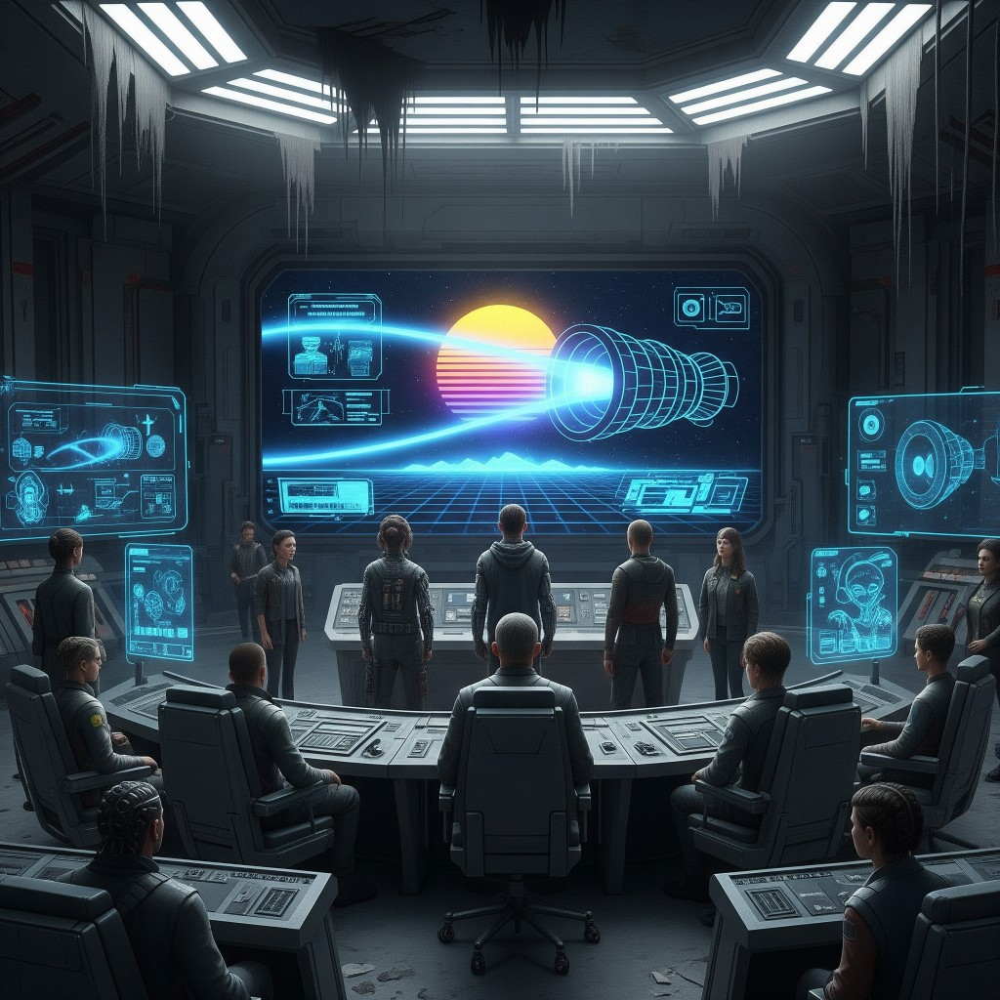

# 06 — Then Go

**Epoca:** 5125  
**Atto:** II  
**Ruolo narrativo:** Connessione confermata. Due mondi, il bore, π — *then go*.

> *Stile: cinematic synth-pop / sci-fi '80s*

## Artwork

---

## Concetto

Dopo No Sense e First Ripples, il 5125 **conferma il collegamento** tra i due mondi. Non è ancora l'invio (→ 80s) né il viaggio in navicella (→ 13 Voyage): è il momento in cui capiscono **come** il segnale passa — bore, π, radio — e scelgono di procedere. *Then go.*

---

## Testo

[Verse 1]  
Two distant worlds in the endless night  
A signal whispers through the void's dark light  
Across the stars where time folds thin  
The universe bends as the dance begins

[Verse 2]  
Through a black hole's twist where silence sings  
The cosmos warps and bends its rings  
3.14 is the beat of time's cry  
A circle's secret whispers in the sky

[Chorus]  
Radio waves in a spiral embrace  
Carving paths through the infinite space  
Squeezing moments till they barely survive  
The rhythm of pi keeps the signal alive — **then go**

[Verse 3]  
Galaxies stretch but the message stays true  
Through the gravity's grip it breaks on through  
Frequencies hum where the darkness is steep  
A connection alive where the light cannot creep

[Bridge]  
The void cannot silence this fragile tone  
Two worlds speaking though they've never known  
A black hole's heartbeat keeps time at bay  
While 3.14 lets the echoes play — **then go**

[Chorus]  
Radio waves in a spiral embrace  
Carving paths through the infinite space  
Squeezing moments till they barely survive  
The rhythm of pi keeps the signal alive — **then go**

---

## Traduzione italiana

[Strofa 1]  
Due mondi lontani nella notte infinita  
Un segnale sussurra attraverso la luce oscura del vuoto  
Attraverso le stelle dove il tempo si piega sottile  
L'universo si curva mentre inizia la danza

[Strofa 2]  
Attraverso la torsione di un buco nero dove il silenzio canta  
Il cosmo deforma e piega i suoi anelli  
3,14 è il battito del pianto del tempo  
Il segreto di un cerchio sussurra nel cielo

[Ritornello]  
Onde radio in un abbraccio a spirale  
Che tracciano sentieri nello spazio infinito  
Comprimendo i momenti finché a malapena sopravvivono  
Il ritmo di pi mantiene vivo il segnale — **allora vai**

[Strofa 3]  
Le galassie si allungano ma il messaggio resta vero  
Attraverso la morsa della gravità si fa strada  
Frequenze che ronzano dove l'oscurità è profonda  
Una connessione viva dove la luce non può penetrare

[Bridge]  
Il vuoto non può zittire questo tono fragile  
Due mondi che parlano pur non essersi mai conosciuti  
Il battito di un buco nero trattiene il tempo  
Mentre 3,14 lascia giocare gli echi — **allora vai**

[Ritornello]  
Onde radio in un abbraccio a spirale  
Che tracciano sentieri nello spazio infinito  
Comprimendo i momenti finché a malapena sopravvivono  
Il ritmo di pi mantiene vivo il segnale — **allora vai**

---

## Modifiche applicate

| # | Modifica | Motivo |
|---|---|---|
| 1 | *then go* in **coro** e **bridge** | Titolo traccia |

---

## ⏳ Da rivedere (opzionali — non ancora applicate)

| # | Riga attuale | Proposta | Motivo |
|---|---|---|---|
| 1 | *Across the stars where time folds thin* | *Through the bore where time folds thin* oppure *Across the years…* | Meno cosmic generico, più lore |
| 2 | *Galaxies stretch but the message stays true* | *The distance stretches but the message stays true* | Richiamo titolo album |
| 3 | Bridge — aggiungere riga | *We tuned their songs — we learned, then go* | Ponte No Sense → 80s |
| 4 | π esplicito | Mantenere solo qui | Canon: π sottile altrove |

---

## Suno — Lyrics

[Verse 1]
Two distant worlds in the endless night
A signal whispers through the void's dark light
Across the stars where time folds thin
The universe bends as the dance begins

[Verse 2]
Through a black hole's twist where silence sings
The cosmos warps and bends its rings
3.14 is the beat of time's cry
A circle's secret whispers in the sky

[Chorus]
Radio waves in a spiral embrace
Carving paths through the infinite space
Squeezing moments till they barely survive
The rhythm of pi keeps the signal alive — then go

[Verse 3]
Galaxies stretch but the message stays true
Through the gravity's grip it breaks on through
Frequencies hum where the darkness is steep
A connection alive where the light cannot creep

[Bridge]
The void cannot silence this fragile tone
Two worlds speaking though they've never known
A black hole's heartbeat keeps time at bay
While 3.14 lets the echoes play — then go

[Chorus]
Radio waves in a spiral embrace
Carving paths through the infinite space
Squeezing moments till they barely survive
The rhythm of pi keeps the signal alive — then go

---

## Suno — Style

This synth-driven track opens in a minor key with analog pad chords and a pulsing bass line, radio static flickering at the edges of the mix. A clear male vocal enters over arpeggiated synthesizers with delay, the verse staying atmospheric and measured. The chorus expands into a wide, anthemic hook — layered synths, driving electronic drums, and a melodic lead line lifting the energy with each repeat. A second verse adds rhythmic density; the bridge pulls back to a darker, half-time feel — filtered vocals, heartbeat-like kick, echoes of the main theme drifting through reverb — before the final chorus returns at full scale. The arrangement favors contrast between intimate verses and expansive choruses, with static and cosmic reverb tying the sections together.

synth-pop, 80s sci-fi, cinematic electronic

---

## Collegamenti

- **←** 04 No Sense · **←** 05 First Ripples
- **→** 07 80s (invio SOS)
- **↔** 13 Voyage

---

Ex-canon tango → 13 Voyage

Vedi `13-voyage-through-forever.md`.

