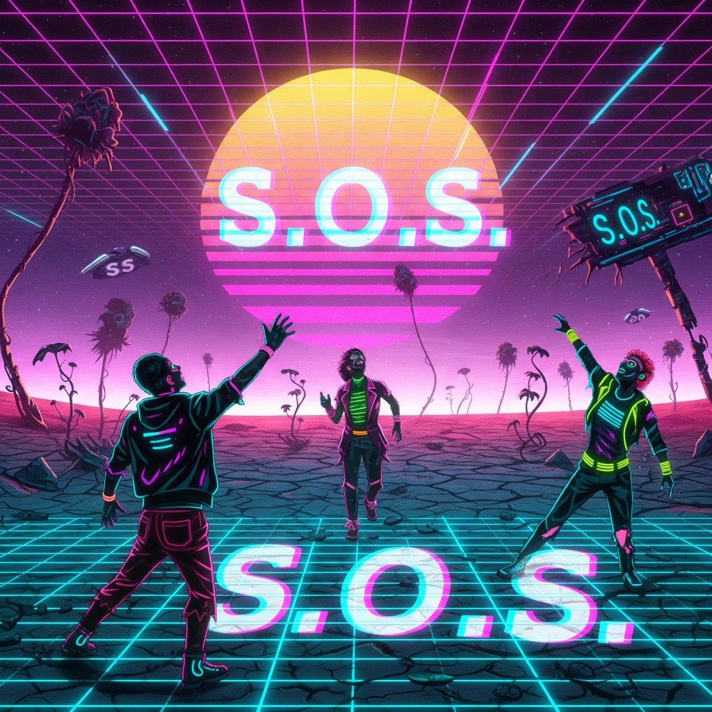

# 06 — 80s (Eighties SOS)

**Epoca:** 1984 *(ricezione)* / 5125 *(origine messaggio)*  
**Atto:** III — Il messaggio attraversa il buco  
**Ruolo narrativo:** Videomessaggio dal 5125 al 1984. Primo contatto attivo.

## Artwork

*Alternativa:* [`07-80s-alt-v1.png`](../ART/07-80s-alt-v1.png)

---

## Concetto

Il 5125 invia un SOS verso il 1984 — non dati, ma un messaggio disperato: *Eighties SOS*. Per chi lo riceve negli anni Ottanta: glitch TV, emissione impossibile, voce dal futuro che chiede soccorso. Estetica '80: neon, VHS, sintetizzatori.

---

## Testo

### [Coro 1] *(da 1:03 a 1:31)*

I look among the stars  
When the time fades in the space  
I'll never stop to search  
A message  
A message in deep space

Eighties SOS  
For an eternity lonely  
I can't reach  
I can't reach  
Reach the sound

Everything is fading  
I will be lost  
in this part of universe

### [Coro 2] *(da 2:52)*

Look at me through the stars  
When the time is running out  
I've never thought to reach  
to reach out  
reach out in deep space

Eighties SOS  
For an eternity lonely  
Stay with me  
Rescue me  
and reach my world

Everything is fading  
we will get lost  
in this part of universe

---

## Traduzione italiana

### [Coro 1] *(da 1:03 a 1:31)*

Guardo tra le stelle  
Quando il tempo svanisce nello spazio  
Non smetterò mai di cercare  
Un messaggio  
Un messaggio nello spazio profondo

SOS anni Ottanta  
Per un'eternità sola  
Non riesco a raggiungere  
Non riesco a raggiungere  
Raggiungere il suono

Tutto sta svanendo  
Mi perderò  
in questa parte dell'universo

### [Coro 2] *(da 2:52)*

Guardami attraverso le stelle  
Quando il tempo sta scadendo  
Non avrei mai pensato di raggiungere  
di raggiungere  
raggiungere nello spazio profondo

SOS anni Ottanta  
Per un'eternità sola  
Resta con me  
Salvami  
e raggiungi il mio mondo

Tutto sta svanendo  
ci perderemo  
in questa parte dell'universo

---

## Analisi

### Cosa funziona

| Elemento | Perché |
|---|---|
| **Eighties SOS** | Titolo/concept fortissimo — SOS *verso* gli anni '80, inviato dal futuro morente |
| **Reach the sound** | Tema album: la musica come unico ponte |
| **Stay with me / Rescue me** | Voce del 5125 che chiede aiuto al passato — tragedia invertita |
| **When the time is running out** | Urgenza — coerente con Then Go → invio |
| **Everything is fading** | Collasso (Jaded), segnale che svanisce (Frantic Caller) |
| **Due corpi a 1:31 e 2:52** | Struttura VHS/timeline — note di produzione utili |

### Direzione narrativa

Il testo legge bene come **messaggio inviato dal 5125 al 1984**:
- *reach my world* = il futuro che cerca di toccare il passato
- *Rescue me* = il mondo morente chiede soccorso a un'epoca ancora viva
- *Eighties SOS* = destinatario esplicito: il 1984

In **ricezione** (lato 1984): glitch, voce impossibile, presagio.

### Problemi / sovrapposizioni

**1. Lessico spaziale (di nuovo)**  
*stars, deep space, universe* — compare anche in Into the Bore e Room (bozza). Tre tracce con lo stesso registro cosmic rischiano di confondersi.

→ In **80s** può restare più spaziale (estetica synth/'80, Major Tom vibe), ma conviene differenziare da Room con lessico **VHS / glitch / broadcast / SOS**.

**2. Ripetizioni interne**

| Ripetuto | Occorrenze |
|---|---|
| *Eighties SOS / For an eternity lonely* | ×2 (intenzionale) |
| *I can't reach* | ×2 |
| *reach out in deep space* | eco del coro 1 |
| *Everything is fading / lost in universe* | ×2 — considerare variazione al coro 2 |

**3. Grammatica (corretta in testo sopra)**

| Originale | Correzione |
|---|---|
| *When the time fade* | *fades* |
| *I'll never end to search* | *I'll never stop to search* |
| *Look me through the stars* | *Look at me through the stars* |
| *Reach The Sound* | *Reach the sound* (coerenza) |

**4. Lacune rispetto alla trama**

- Nessun riferimento a **videomessaggio** / TV / VHS / glitch
- **Then Go** (05) ancora vuota — qui siamo già in invio; la decisione collettiva va scritta prima
- Non emerge il **bore** — opzionale (arriva in Dadej)

### Confine con altre tracce

| Traccia | Confine |
|---|---|
| **Room** | Room = ricezione passiva, *we copy*. 80s = invio attivo, *SOS/rescue* |
| **No Sense** | No Sense = domande intime. 80s = grido di soccorso corale/SOS |
| **ReNew** | 80s = contatto immateriale. ReNew = navicella materiale |
| **Dadej** | 80s precede il passaggio attraverso il bore |

---

## Note di produzione

- `[coro] Da 1:03 a 1:31` — prima sezione / drop
- `[coro] Da 2:52` — seconda sezione, escalation (*Rescue me / reach my world*)

---

## Da valutare (revisione futura)

- [ ] Integrare lessico VHS/TV/glitch senza perdere *Eighties SOS*
- [ ] Variare chiusura coro 2 (*we will get lost…*)
- [ ] Chiarire POV in produzione: voce 5125 inviante vs eco ricevuta nel '84
- [ ] Ridurre *stars/deep space* se si allinea Room/Into the Bore a bore/tempo

---

## Collegamenti

- **←** 05 Then Go (decisione di inviare)
- **→** 07 Dadej (il messaggio attraversa il bore)
- **→** 09 Distance Proof (chi riceve/assembla)

---

Bozza originale ODT (archivio)

[coro] Da 1:03 a 1:31

I look among the stars  
When the time fade in the space  
I'll never end to search  
A message  
A message in deep space  
Eighties SOS  
For an eternity lonely  
I can't reach  
I can't reach  
Reach The Sound  
Everything is fading  
I will be lost  
in this part of universe  

[coro] Da 2:52

Look me through the stars  
When the time is running out  
I've never thought to reach  
to reach out  
reach out in deep space  
Eighties SOS  
For an eternity lonely  
Stay with me  
Rescue me  
and Reach my world  
Everything is fading  
we will get lost  
in this part of universe  

