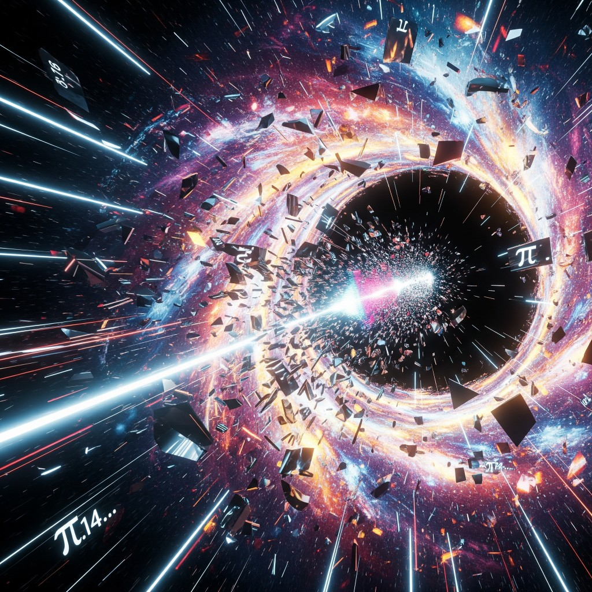

# 07 — Dadej

**Epoca:** Atemporale (il passaggio)  
**Atto:** III — Il messaggio attraversa il buco  
**Ruolo narrativo:** Jaded al contrario. Il segnale attraversa il bore.

## Artwork

---

## Concetto

**Dadej = Jaded al contrario.** Letteralmente: la traccia 02 (*Jaded*) riprodotta in **reverse**.

Il segnale inviato in 80s attraversa il *bore* e non produce qualcosa di nuovo — produce l'**eco invertita** del collasso. Ciò che il mondo ha perso, riascoltato al contrario, distorto, attraversato dal buco nero.

Strutturalmente, tracce 02 e 07 sono **specchi**:
- 02 Jaded → il mondo che cade, in avanti
- 07 Dadej → lo stesso mondo, al contrario, attraverso il bore

## Note tecniche

- Reverse di Jaded (02) — stesso materiale sonoro, direzione opposta
- Possibile overlap con elementi di 80s (06) per il passaggio
- Traccia liminale / strumentale o quasi

## Temi

- Reverse / specchio
- Eco del collasso
- Distorsione temporale
- Liminalità

## Collegamenti

- **←** 02 Jaded (fonte diretta — stessa traccia in reverse)
- **←** 06 80s (il segnale in viaggio)
- **→** 08 ReNew (dopo l'eco immateriale, il contatto materiale)

---

## Testo

*(reverse di Jaded — nessun testo originale)*

---

## Traduzione italiana

*(reverse di Jaded — vedi traduzione traccia 02, letta al contrario)*
