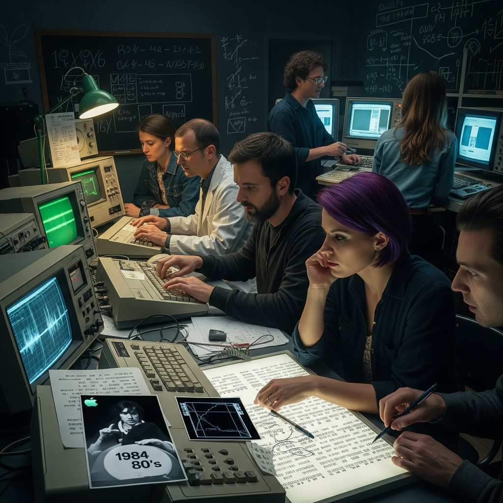

# 10 — The Code Within

**Epoca:** 1984  
**Atto:** III  
**Ruolo narrativo:** Scienziati scoprono che la hit è una richiesta d'aiuto.

## Artwork

---

## Concetto

Mentre il mondo balla con l'Anthem from Nowhere, scienziati, crittografi e musicisti analizzano struttura armonica, testo, video. Pattern anomali, ripetizioni, coordinate nascoste. Si capisce: **non è solo musica — è un SOS**.

---

## Testo

*(da scrivere)*

---

## Traduzione italiana

*(testo da scrivere)*

---

## Collegamenti

- **←** 09 Room Pt.2
- **→** 15 Distance Proof
