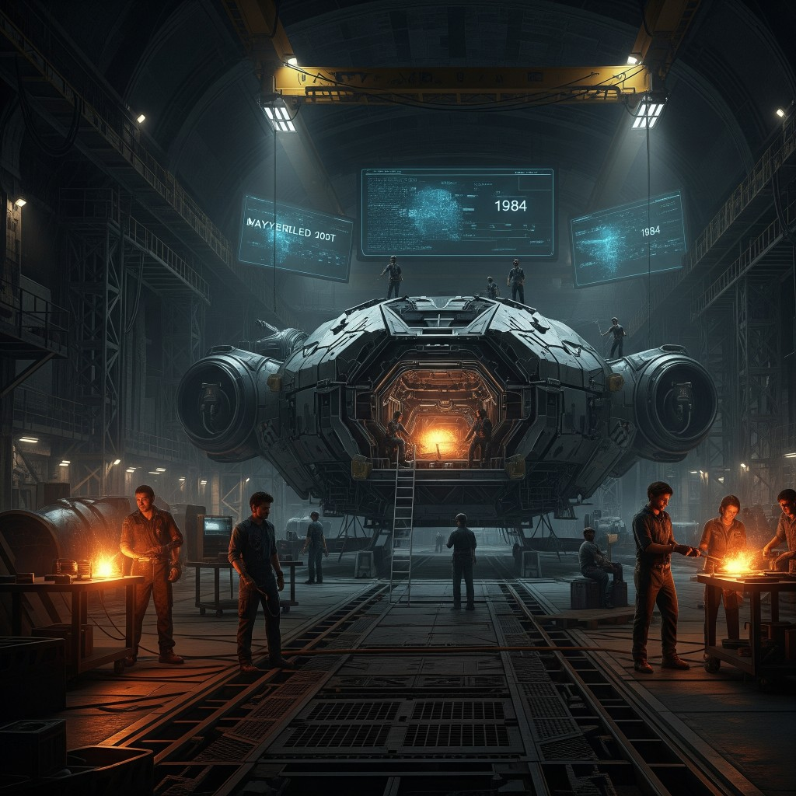

# 08 — ReNew

**Epoca:** 5125  
**Atto:** III — Il messaggio attraversa il buco  
**Ruolo narrativo:** Partenza navicella verso il 1984.

## Artwork

---

## Concetto

Dopo il segnale immateriale (80s → Dadej), il 5125 compie un gesto più concreto: **parte una navicella** destinata al 1984. Non un viaggio nel tempo con esseri viventi — un contenitore di memoria, canzoni, prove. L'ultima speranza di un mondo morente.

Il titolo *ReNew* risuona contro *Jaded*: dal collasso al tentativo di rinnovamento.

## Temi

- Speranza nell'oscurità
- Partenza / addio
- Memoria che viaggia
- Rinnovamento vs stanchezza (renew vs jaded)

## Collegamenti

- **←** 02 Jaded (contrappunto diretto)
- **←** 07 Dadej (dopo il segnale, la risposta materiale)
- **→** 09 Distance Proof (la navicella come prova)

## Domande aperte

- Cosa contiene esattamente la navicella?
- C'è qualcuno che la lancia / la vede partire?
- La partenza è trionfale o funebre?

---

## Testo

*(da scrivere)*

---

## Traduzione italiana

*(testo da scrivere)*
