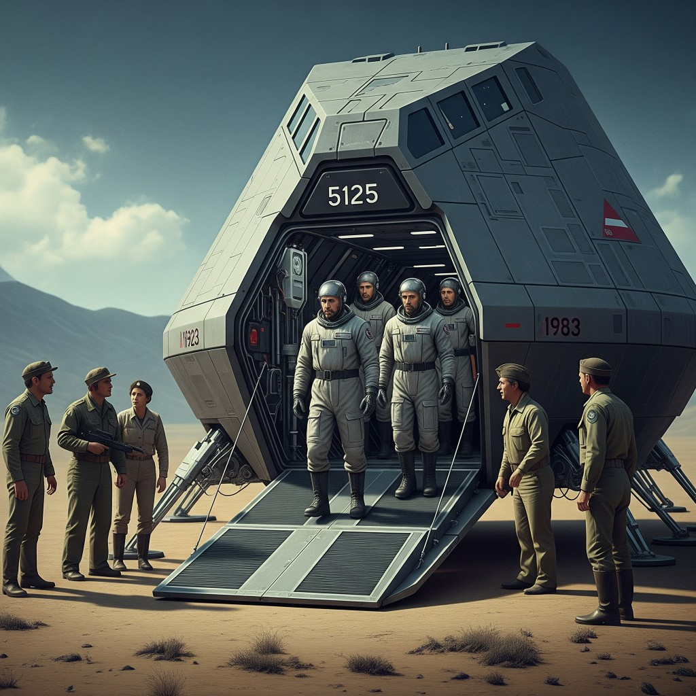

# 14 — The Landing (Knowledge Bearers)

**Epoca:** 1983  
**Atto:** IV  
**Ruolo narrativo:** Navicella arriva. Viaggiatori portano conoscenza — non possono cambiare il passato.

## Artwork

---

## Concetto

La navicella dal 5125 atterra nel 1983. A bordo: il **narratore** e **she** (compagna di viaggio). Emergono come araldi di un futuro terribile — prove, dati, avvertimenti. **Non possono cambiare il passato.**

### Spunti lirici (Concept.odt)

- *We crossed the ages, a whisper through Pi's gate.*
- *With ashes of tomorrow, we stand on yesterday's grass.*
- *This knowledge is a burden, a map to a future lost.*
- *We cannot steer your present, only show the coming frost.*

Reazione 1983: paura, scetticismo, meraviglia.

---

## Testo

*(da scrivere)*

---

## Traduzione italiana

*(testo da scrivere — spunti in Concetto)*

- *Abbiamo attraversato le epoche, un sussurro attraverso la porta di Pi.*
- *Con le ceneri di domani, stiamo sull'erba di ieri.*
- *Questa conoscenza è un fardello, una mappa verso un futuro perduto.*
- *Non possiamo guidare il vostro presente, solo mostrare il gelo che viene.*

---

## Collegamenti

- **←** 13 Voyage Through Forever
- **→** 15 Distance Proof
