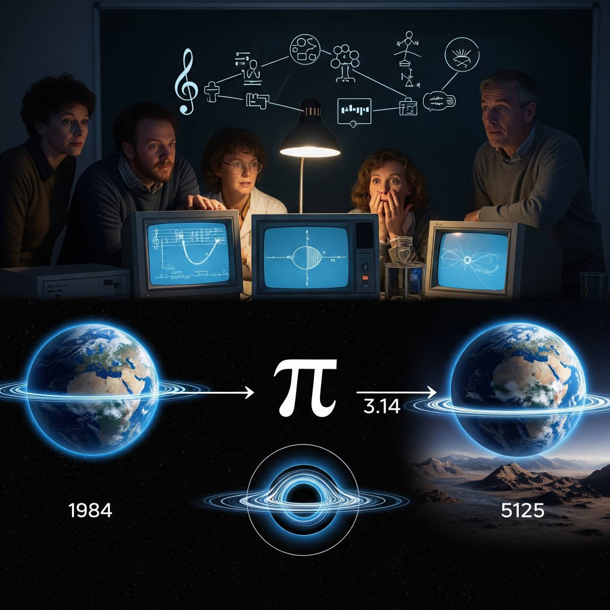

# 09 — Distance Proof

**Epoca:** 1984  
**Atto:** IV — La prova  
**Ruolo narrativo:** Climax, rivelazione e tragedia.

## Artwork

---

## Concetto

Nel 1984, voci anonime assemblano tutti i pezzi. La prova emerge — ma arriva troppo tardi. Il testo attuale è **intimo e colpevole**: non spiega la rivelazione, la *incarna*.

---

## Testo (bozza attuale)

*(Distance Proof – Distance Proof Band)*

I lived by dream  
And I let it begin  
Now, here at your side  
with nothing left to desire

Dream  
Now dream  
A home  
To get by

And feel my skin I'd left, for green  
My sins are intense  
My heart is betrayed by my eyes

---

## Traduzione italiana

Ho vissuto di sogno  
E ho lasciato che iniziasse  
Ora, qui al tuo fianco  
senza più nulla da desiderare

Sogna  
Ora sogna  
Una casa  
Per sopravvivere

E sento la mia pelle che avevo lasciato, per il verde  
I miei peccati sono intensi  
Il mio cuore è tradito dai miei occhi

---

## Analisi

### Cosa funziona

| Elemento | Perché |
|---|---|
| **My sins are intense** | Coerente con la rivelazione: il 1984 ha già distrutto il futuro. Colpa senza nome |
| **My heart is betrayed by my eyes** | La prova vista ma inaccettabile — si sa, ma non si può agire |
| **I lived by dream / I let it begin** | Innocenza del passato — ha lasciato accadere qualcosa senza vederne la fine |
| **with nothing left to desire** | Chiusura tragica: dopo la rivelazione, vuoto |
| **Dream / Now dream / A home / To get by** | Frammento quasi-ninnananna — resa, non redenzione. Tono giusto per tragedia |
| **feel my skin I'd left, for green** | Possibile eco ambientale — corpo/natura abbandonati. Da chiarire |

### Bookend con Into the Bore

| 01 — Into the Bore | 09 — Distance Proof |
|---|---|
| *Where's the **proof** we're looking for?* | *My sins are intense* — la prova non è dati, è colpa |
| Domande cosmiche, apertura | Risposta intima, chiusura |
| *Sick, sick, we are sick* | *nothing left to desire* — malattia → esaurimento |

La parola **proof** non compare nel testo attuale — il titolo la porta, ma il testo resta sul piano personale. Funziona se la produzione lega il pezzo al tema; altrimenti conviene una riga esplicita.

### Lacune rispetto alla trama

Il climax narrativo prevede due rivelazioni:

1. **I due mondi sono lo stesso mondo** — non presente
2. **Il 1984 ha già distrutto il futuro** — implicito in *sins*, non esplicito
3. **Nessuno può agire** — *nothing left to desire* ci va vicino, ma manca il senso di impotenza di fronte al tempo

Il testo è **troppo breve** per chiudere un concept album di 9 tracce. Manca:
- ritornello / hook *Distance Proof*
- riferimento a segnali, navicella, canzoni ricevute
- eco di Room / 80s / Into the Bore
- una strofa che *nomini* la distanza (temporale, non spaziale)

### Confine con No Sense

| No Sense | Distance Proof |
|---|---|
| Domande (*Will you…?*) | Affermazioni / constatazioni |
| *I look faint, still alive* | *nothing left to desire* — da sopravvivenza a resa |
| Interrogatorio al passato | Colpa del passato |

Buon confine di registro — No Sense chiede, Distance Proof constata.

### Note testuali

| Originale | Nota |
|---|---|
| *betraied* | → *betrayed* |
| *Now, here At your side* | → *at* (minuscolo) |
| *r* (riga isolata) | Probabilmente artefatto ODT — omesso |
| *Distance Proof Band* | Header — band name? meta? Da chiarire |

---

## Cosa manca (per chiudere l'album)

- [ ] Strofa o ritornello con **proof** / **distance** espliciti
- [ ] Collegamento ai segnali assemblati (Room, 80s, ReNew)
- [ ] Rivelazione *same world* — almeno un'immagine
- [ ] Chiusura tragica chiara: sapere ≠ poter cambiare
- [ ] Possibile richiamo a Into the Bore (*sick* → *sins*, *proof*)

---

## Direzione suggerita (senza riscrittura)

Tenere il blocco attuale come **strofa finale** o **outro** — resa dopo la rivelazione. Aggiungere prima:

1. **Strofa 1** — assemblaggio segnali (1984 che capisce)
2. **Ritornello** — *Distance proof* / *the distance* / *same world*
3. **Strofa 2** — colpa, futuro già perso
4. **Outro attuale** — *Dream now dream… nothing left to desire*

---

## Collegamenti

- **←** 01 Into the Bore (*proof* — bookend)
- **←** 06 80s (SOS ricevuto)
- **←** 08 ReNew (navicella come prova)
- **←** 04 No Sense (*still alive* → *nothing left to desire*)

---

Bozza originale ODT (archivio)

Distance Proof – Distance Proof Band  
r  
I lived by dream  
And I let it begin  
Now, here At your side  
with nothing left to desire  
Dream  
Now dream  
A home  
To get by  
And feel my skin I'd left, for green  
My sins are intense  
My heart is betraied by my eyes  

